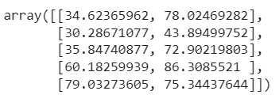
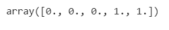
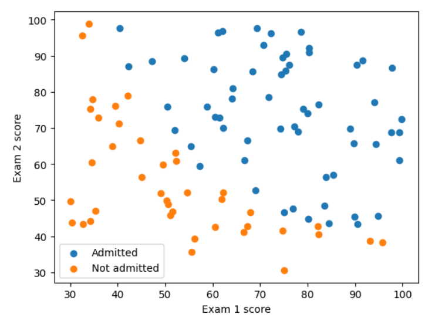
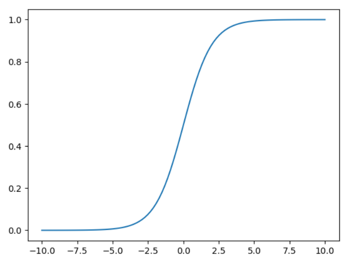
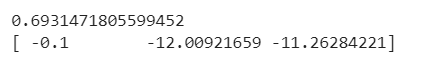
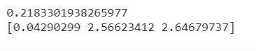
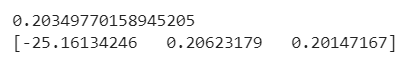
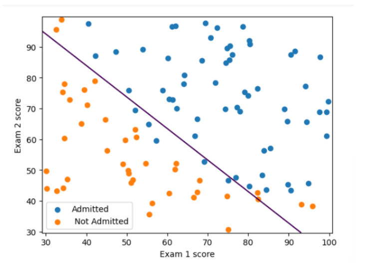
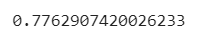
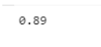

# Implementation-of-Logistic-Regression-Using-Gradient-Descent

## AIM:

To write a program to implement the the Logistic Regression Using Gradient Descent.

## Equipments Required:

1. Hardware – PCs
2. Anaconda – Python 3.7 Installation / Jupyter notebook

## Algorithm

1. Use the standard libraries in python for finding linear regression.
2. Set variables for assigning dataset values.
3. Import linear regression from sklearn.
4. Predict the values of array.
5. Calculate the accuracy, confusion and classification report b importing the required modules from sklearn.
6. Obtain the graph.

## Program:


Program to implement the the Logistic Regression Using Gradient Descent.

Developed by:  VINOD KUMAR.S

RegisterNumber:  212222240116

```python
import pandas as pd
import numpy as np
import matplotlib.pyplot as plt
from scipy import optimize

data = np.loadtxt("ex2data1.txt",delimiter=",")
X = data[:,[0,1]]
Y = data[:,2]

X[:5]

Y[:5]

# VISUALIZING THE DATA
plt.figure()
plt.scatter(X[Y== 1][:, 0], X[Y==1][:,1],label="Admitted")
plt.scatter(X[Y==0][:,0],X[Y==0][:,1],label="Not admitted")
plt.xlabel("Exam 1 score")
plt.ylabel("Exam 2 score")
plt.legend()
plt.show()

def sigmoid(z):
    return 1/(1+np.exp(-z))

plt.plot()
X_plot=np.linspace(-10,10,100)
plt.plot(X_plot,sigmoid(X_plot))
plt.show()

def costFunction(theta, X, Y):
    h = sigmoid(np.dot(X, theta))
    J = -(np.dot(Y, np.log(h)) + np.dot(1-Y,np.log(1-h))) / X.shape[0]
    grad = np.dot(X.T, h-Y)/X.shape[0]
    return J,grad

X_train = np.hstack((np.ones((X.shape[0],1)),X))
theta = np.array([0,0,0])
J,grad = costFunction(theta,X_train,Y)
print(J)
print(grad)

X_train = np.hstack((np.ones((X.shape[0],1)),X))
theta = np.array([-24,0.2,0.2])
J,grad = costFunction(theta,X_train,Y)
print(J)
print(grad)

def cost(theta,X,Y):
  h=sigmoid(np.dot(X,theta))
  J=-(np.dot(Y,np.log(h))+np.dot(1-Y,np.log(1-h)))/X.shape[0]
  return J

def gradient(theta,X,Y):
  h=sigmoid(np.dot(X,theta))
  grad=np.dot(X.T,h-Y)/X.shape[0]
  return grad

X_train=np.hstack((np.ones((X.shape[0],1)),X))
theta=np.array([0,0,0])
res=optimize.minimize(fun=cost,x0=theta,args=(X_train,Y),method='Newton-CG',jac=gradient)
print(res.fun)
print(res.x)

def plotDecisionBoundary(theta,X,Y):
    X_min , X_max = X[:, 0].min() - 1,X[:,0].max() + 1
    Y_min , Y_max = X[:, 1].min() - 1,X[:,1].max() + 1
    XX,YY = np.meshgrid(np.arange(X_min,X_max,0.1),
                        np.arange(Y_min,Y_max,0.1))
    X_plot = np.c_[XX.ravel(), YY.ravel()]
    X_plot = np.hsatck((np.ones((X_plot.shape[0],1)),X_plot))
    Y_plot = np.dot(X_plot, theta).reshape(XX.shape)
    plt.figure()
    plt.scatter(X[Y==1][:,0],X[Y==1][:,1],label='Admitted')
    plt.scatter(X[Y==1][:,0],X[Y==1][:,1],label='Not admitted')
    plt.contour(XX,YY,Y_plot,levels=[0])
    plt.Xlabel("Exam 1 score")
    plt.Ylabel("Exam 2 score")
    plt.legend()
    plt.show()

print("Decision boundary-graph for exam score:")
plotDecisionBoundary(res.x,X,Y)


prob=sigmoid(np.dot(np.array([1,45,85]),res.x))
print(prob)

def predict(theta, X):
  X_train=np.hstack((np.ones((X.shape[0],1)),X))
  prob=sigmoid(np.dot(X_train,theta))
  return (prob >= 0.5).astype(int)

np.mean(predict(res.x,X)==y)


```

## Output:

### Array value of X:



### Array value of Y:



### Exam 1-Score graph:



### Sigmoid function graph:



### X_Train_grad value:



### Y_Train_grad value:



### Print res.X:



### Decision boundary-gragh for exam score:



### Probability value:



### Prediction value of mean:



## Result:

Thus the program to implement the the Logistic Regression Using Gradient Descent is written and verified using python programming.
